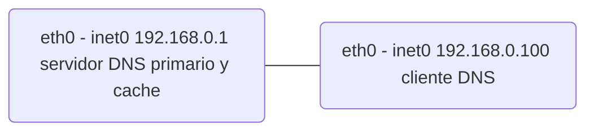

# Practica 1.3: Domain Name System (DNS)

# Objetivos
En esta práctica, emplearemos herramientas cliente DNS para explorar la estructura del servicio en Internet. Después, configuraremos un servicio de nombres basado en BIND. El objetivo es estudiar tanto los pasos básicos de configuración del servicio como la base de datos y funcionamiento del protocolo.

# Cliente DNS
Usaremos las herramientas clientes DNS, que serán de utilidad tanto para depurar el despliegue del servicio DNS en nuestra red local, como para estudiar la estructura de DNS en Internet. Las herramientas principales para consultar un servicio DNS son dig y host. Para esta primera parte,  **se usará la máquina física**  del puesto del laboratorio. Si las consultas DNS a determinados servidores estuvieran bloqueadas,  **se usará un interfaz web**como  [www.digwebinterface.com](http://www.digwebinterface.com/)  (activando las opciones “Stats” y “Show command”) o  [www.diggui.com](http://www.diggui.com/).

### Ejercicio 1
El archivo de configuración del cliente DNS es /etc/resolv.conf. Consultar la página de manual de resolv.conf y estudiar el significado de las opciones nameserver y search. Ver el contenido del archivo en la máquina física del laboratorio.

### Ejercicio 2 
Partiendo únicamente del servidor raíz a.root-servers.net y de las respuestas obtenidas de cada servidor obtener la dirección IP de  [informatica.ucm.es](http://informatica.ucm.es/). Determinar el TTL de cada registro y completar la siguiente tabla:
| Servidor | Nombre | TTL | Tipo | Datos | 
|--|--|--|--|--|
|  |  |  |  |  |  |

**NOTA:** Usar el comando dig @<servidor> <nombre> <tipo>. Más información en la página de manual de dig.

### Ejercicio 3 
Obtener el registro SOA de ucm.es. usando un servidor autoritativo de la zona. Identificar los campos relevantes del registro.

### Ejercicio 4
Determinar qué servidor debería usarse para enviar un mail a  [webmaster@fdi.ucm.es](mailto:webmaster@fdi.ucm.es).

### Ejercicio 5
Determinar el nombre de dominio para 147.96.85.71. Al igual que en el ejercicio 2, usar únicamente el servidor raíz a.root-servers.net y las respuestas obtenidas a partir de éste. Completar la siguiente tabla:
| Servidor | Nombre | TTL | Tipo | Datos | 
|--|--|--|--|--|
|  |  |  |  |  |  |

**NOTA:** La opción -x de dig (en el interfaz web, se activa seleccionando “Reverse” como tipo de registro) facilita la búsqueda inversa cuando detecta una dirección IP como argumento, creando el dominio de búsqueda a partir de la dirección IP (esto es, invierte el orden de los bytes y añade .in-addr.arpa.) y estableciendo el tipo de registro por defecto a PTR.

### Ejercicio 6
Obtener la IP de  [www.google.com](http://www.google.com/)  usando el servidor por defecto. Usar el comando dig con la opción +trace y observar las consultas realizadas.
# Servidor DNS
## Preparación del entorno
Para esta parte, configuraremos la topología de red que se muestra en la siguiente figura:


Como en prácticas anteriores, construiremos la topología con la herramienta vtopol y un archivo de topología adecuado. Configurar los interfaces de red como se indica en la figura y comprobar la conectividad entre las máquinas.

## Zona directa (_forward_)
La máquina VM1 actuará como servidor de nombres del dominio labfdi.es. La mayoría de los registros se incluyen en la zona directa.

### Ejercicio 7
Configurar el servidor de nombres añadiendo una entrada zone para la zona directa en el fichero /etc/named.conf. El tipo de servidor de la zona debe ser master y el archivo que define la zona, db.labfdi.es. Por ejemplo:
```c
zone "labfdi.es." {
	type master;
	file "db.labfdi.es";
};
```
Revisar la configuración por defecto y consultar la página de manual de named.conf para ver las opciones disponibles para el servidor y las zonas. Por ejemplo, la recursión debe estar deshabilitada en servidores autoritativos y las consultas pueden estar restringidas a ciertas máquinas (directiva allow-query).

Una vez creado el archivo de configuración, ejecutar el comando named-checkconf para comprobar que la sintaxis es correcta.
### Ejercicio 8
Crear el archivo de la zona directa labfdi.es. en /var/named/db.labfdi.es con los registros especificados en la siguiente tabla. Especificar también la directiva $TTL.

### Ejercicio 9
### Ejercicio 10
### Ejercicio 11


<!--stackedit_data:
eyJoaXN0b3J5IjpbLTc0MTAzNDk2Nl19
-->